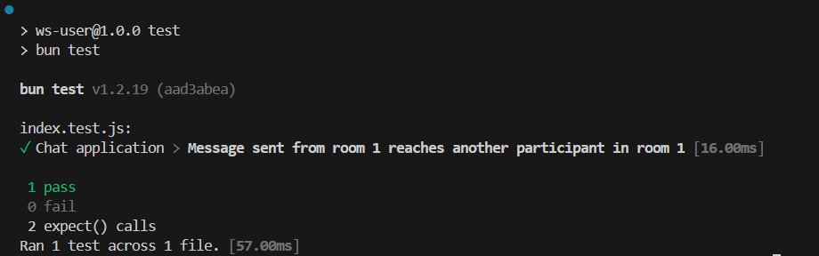

# Scalable WebSocket Chat Application

This project is a proof-of-concept for a horizontally scalable, real-time chat application built with Node.js and WebSockets. It demonstrates a microservices-like architecture where user-facing servers can be scaled independently while maintaining communication through a central message relayer.

## Demo

Here is a screenshot of the application in action, showing two clients in the same room communicating across separate server instances.



## Architecture

The application is split into two main services, designed to work together to create a distributed system:

*   **`ws-user`**: A stateful WebSocket server that manages direct client connections and room logic. Multiple instances of this service can be run simultaneously behind a load balancer to handle a large number of users.
*   **`ws-relayer`**: A simple, stateless message broker. It receives messages from one `ws-user` instance and broadcasts (relays) them to all other connected `ws-user` instances. This acts as a basic publish/subscribe (Pub/Sub) system, enabling communication across the distributed user-facing servers.

This design allows the application to scale horizontally. As more users connect, you can simply launch more `ws-user` instances without modifying the core logic.

```
                               +----------------+
                               |                |
 Client A <------------------> |  ws-user @8080 |
                               |                |
                               +-------+--------+
                                       |
                                       |
                               +-------v--------+
                               |                |
                               |   ws-relayer   |
                               |                |
                               +-------+--------+
                                       |
                                       |
                               +-------v--------+
                               |                |
 Client B <------------------> |  ws-user @8081 |
                               |                |
                               +----------------+
```

## Technologies Used

*   **Runtime**: Node.js
*   **Language**: JavaScript
*   **Core Protocol**: WebSockets (via the `ws` library)
*   **Package Management**: npm
*   **Testing**: Bun Test Runner for end-to-end tests
*   **Version Control**: Git

## Getting Started

### Prerequisites

*   Node.js and npm
*   Bun (for running the test suite)

### Installation

1.  Clone the repository.
2.  Install dependencies for both services from the project root:

    ```sh
    # Install dependencies for the user-facing service
    cd ws-user && npm install && cd ..

    # Install dependencies for the relayer service
    cd ws-relayer && npm install && cd ..
    ```

### Running the Application

You will need at least two separate terminals to run the application.

1.  **Terminal 1: Start the Relayer Service**
    ```sh
    cd ws-relayer
    node index.js
    ```

2.  **Terminal 2: Start the User-Facing Service**
    ```sh
    cd ws-user
    node index.js
    ```
    You can start additional `ws-user` instances on different ports by setting the `PORT` environment variable:
    ```sh
    # PowerShell
    $env:PORT=8081; node index.js

    # Git Bash / Linux / macOS
    PORT=8081 node index.js
    ```

### Running Tests

The project includes an end-to-end test that validates the communication between two clients connected to separate server instances. To run it, you must have the full environment running as described in the test file (`ws-user/index.test.js`).

1.  Start the `ws-relayer` service in one terminal.
2.  Start a `ws-user` instance on port `8080` in a second terminal.
3.  Start another `ws-user` instance on port `8081` in a third terminal.
4.  In a fourth terminal, navigate to the `ws-user` directory and run:
    ```sh
    npm test
    ```